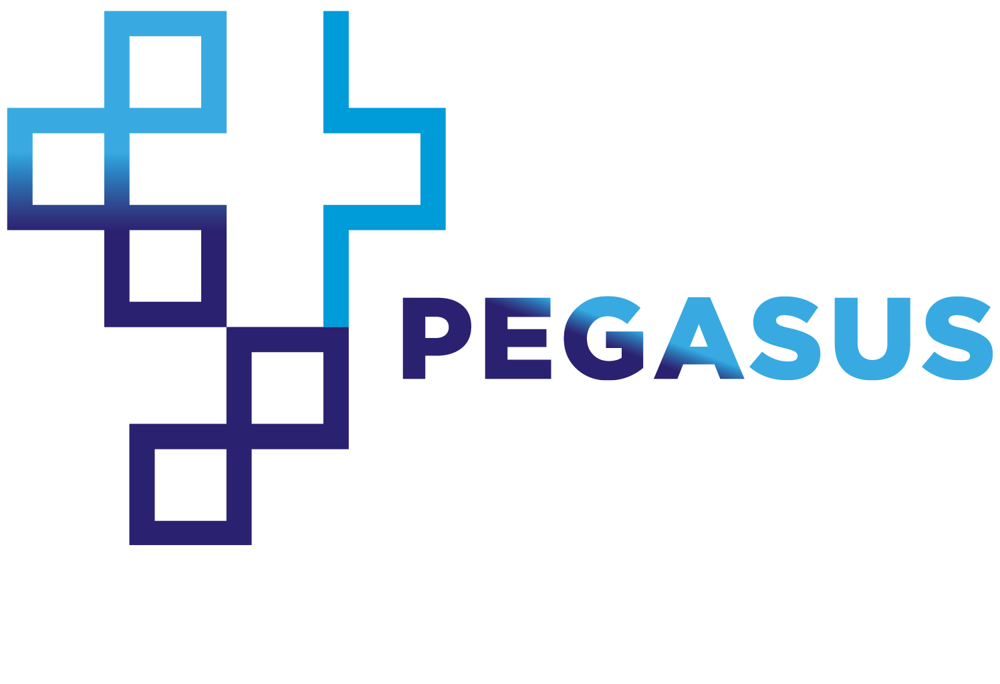

<p align="left">
  
 </p>
**Plataforma Eletrônica de Governança e Accountability do SUS**

[](https://travis-ci.org/SecexSaudeTCU/pegasus)

<p align="justify">Este projeto está dividido em n módulos. Um dos módulos
implementados, denominado dados, permite criar um <i>schema</i> de um banco
de dados PostgreSQL, anteriormente criado no computador do usuário, e inserir nele
dados das bases dos seguintes sistemas de informações em saúde do Sistema Único
de Saúde (SUS): CNES, SIH, SIA, SIM, SINASC ou SINAN (por enquanto). O módulo
dados também permite que se faça a leitura de arquivos principais de dados (em
formato <i>.dbc</i>) e de arquivos auxiliares de dados dessas bases do SUS (em
formato <i>.dbf</i> ou <i>.cnv</i>) diretamente como objetos pandas DataFrame.
Essa segunda opção é recomendada no caso de consulta mais pontual.</p>

<p align="justify">O outro módulo deste projeto já implementado se denomina analise
e realiza análise de anomalias estatísticas das bases de dados do SIH e SIA...</p>

## Instalação do módulo dados

<p align="justify">Para o uso do módulo dados por estrutura de banco de dados
PostgreSQL é necessário instalar o SGBD <a href="https://www.postgresql.org/download/">PostgreSQL</a>
e é recomendável ter um software para gerenciamento de banco de dados, tal como
<a href="https://www.pgadmin.org/download/">pgAdmin</a> ou <a href="https://dbeaver.io/">DBeaver Community</a>,
para visualizar os dados estruturados.

Para uso do módulo dados em plataformas Linux ou MacOS é necessária a instalação
da dependência libffi:</p>
1) Linux: `$ sudo apt install libffi-dev`
2) MacOS: `$ brew install libffi`

<p align="justify">Para uso em plataformas Windows, é necessária a instalação do
programa executável (<i>.exe</i>) dbf2dbc que faz parte do programa TabWin do
Datasus. Para isso, faça o download da pasta "Tab415.zip" selecionando o
link homônimo contido na primeira linha da coluna "Nome" da tabela que aparece
<a href="http://www2.datasus.gov.br/DATASUS/index.php?area=060805&item=3">aqui</a>.
Descompacte a pasta "Tab415.zip", copie o executável "dbf2dbc.exe" e o arquivo
"IMPBORL.DLL" (a pasta descompactada "Tab415" e seu <i>.zip</i> podem então ser
deletados) para uma pasta nova denominada "dbf2dbc" no <i>root directory</i> do
computador do usuário, o qual toma normalmente a seguinte forma em plataformas
Windows:</p>

```C:\```

Por fim, instala-se o módulo dados através do comando (em plataformas Linux):

```$ sudo pip install pegasus-dados```

## Exemplos do uso do módulo dados
...

## Exemplos do uso do módulo analise
...
